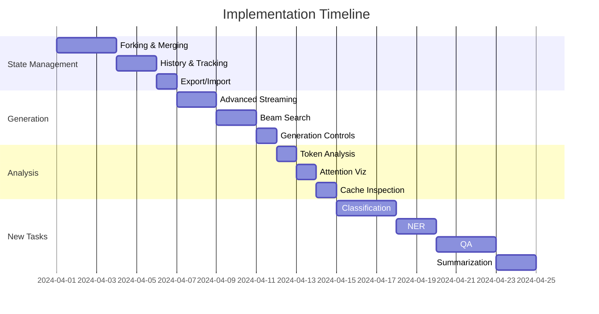

# Cacher API v3

A stateful caching API for language models that provides efficient state management, generation, and analysis capabilities. Built with FastAPI and modern Python async features.

## Features

### State Management
- Persistent state storage with JSON files
- Automatic UUID-based state identification
- State forking and merging capabilities
- Configurable state cleanup and cache management
- Metadata tracking (creation time, modifications)

### Generation
- Token-by-token streaming generation
- Configurable parameters (temperature, top_p)
- Beam search with diversity penalties
- Stop sequence support
- Real-time streaming responses
- Configurable batch sizes
- Deterministic generation with seeding support
- State isolation for reproducible outputs

### Reproducibility
- Seed-based deterministic generation
- Independent state management for consistent outputs
- Configurable temperature and top_p parameters
- State isolation to prevent cross-contamination
- Automatic seed propagation across generations
- Support for both cached and uncached reproducible outputs

### Analysis & Introspection
- Token-level analysis with logprobs
- Attention pattern visualization with thresholding
- Key/value cache inspection by layer
- Normalized attention patterns
- Layer and head-specific analysis

## Quick Start

1. Install dependencies using Poetry:
```bash
# Install Poetry if you haven't already
curl -sSL https://install.python-poetry.org | python3 -

# Install project dependencies
poetry install
```

2. Start the server:
```bash
poetry run uvicorn cacher_api3.main:app --reload
```

3. Run the demo:
```bash
poetry run python -m cacher_api3.demo
```

## Client Usage

```python
import asyncio
from cacher_api3.demo import CacherClient

async def main():
    async with CacherClient() as client:
        # Create a state with seeding for reproducibility
        state = await client.create_state(
            "gpt2",
            "Once upon a time",
            config={
                "temperature": 0.7,
                "top_p": 0.9,
                "seed": 42  # Set seed for reproducibility
            }
        )
        state_id = state["state_id"]

        # Generate with reproducible output
        result1 = await client.generate_tokens(
            state_id,
            max_tokens=10,
            temperature=0.8,
            seed=42  # Same seed ensures reproducible output
        )

        # Create new state for second generation
        state2 = await client.create_state(
            "gpt2",
            "Once upon a time",
            config={
                "temperature": 0.7,
                "top_p": 0.9,
                "seed": 42  # Same seed
            }
        )

        # Generate again - should produce identical output
        result2 = await client.generate_tokens(
            state2["state_id"],
            max_tokens=10,
            temperature=0.8,
            seed=42
        )

        assert result1["text"] == result2["text"]  # Outputs should match

if __name__ == "__main__":
    asyncio.run(main())
```

## Demo Template

The project includes a `demo-template.py` file that provides a structured template for creating demos. This template implements best practices for state management, error handling, and resource cleanup.

### Template Structure

```python
class CacherDemo:
    """Base class for creating Cacher API demos."""
    
    async def setup(self):
        """Setup demo resources"""
        
    async def cleanup(self):
        """Cleanup resources"""
        
    async def create_demo_state(self):
        """Create and track a new state"""
        
    async def run_basic_generation(self):
        """Basic generation demo"""
        
    async def run_reproducible_generation(self):
        """Reproducible generation demo"""
        
    async def run_token_analysis(self):
        """Token analysis demo"""
```

### Features

- Automatic state tracking and cleanup
- Rich console logging with colors and formatting
- Exception handling and error reporting
- Structured demo organization
- Resource management best practices

### Usage

1. Create a new demo file:
```python
from cacher_api3.demo_template import CacherDemo

class MyDemo(CacherDemo):
    async def run_custom_demo(self):
        # Create state
        state_id = await self.create_demo_state(
            "My demo text",
            config={"temperature": 0.7}
        )
        
        # Generate text
        result = await self.client.generate_token(
            state_id,
            max_tokens=10
        )
        
        # Display results
        self.logger.info(f"Generated: {result['text']}")

async def main():
    demo = MyDemo()
    try:
        await demo.setup()
        await demo.run_custom_demo()
    finally:
        await demo.cleanup()

if __name__ == "__main__":
    asyncio.run(main())

2. Run your demo:
```bash
poetry run python my_demo.py
```

The template handles common tasks like:
- Setting up logging and console output
- Managing state lifecycle
- Proper cleanup of resources
- Error handling and reporting
- Structured demo organization

## API Reference

### State Management

#### Create State with Seed
```http
POST /states
Content-Type: application/json

{
    "model_id": "gpt2",
    "text": "Optional initial text",
    "config": {
        "temperature": 0.7,
        "top_p": 0.9,
        "seed": 42  // Optional seed for reproducibility
    }
}
```

#### Generate Tokens with Seed
```http
POST /generate/token
Content-Type: application/json

{
    "state_id": "...",
    "max_tokens": 10,
    "temperature": 0.8,
    "top_p": 0.9,
    "seed": 42,  // Optional seed for reproducibility
    "stop_sequences": [".", "\n"],
    "stream": true
}
```

#### Get State
```http
GET /states/{state_id}
```

#### Delete State
```http
DELETE /states/{state_id}
```

### Generation

#### Generate Tokens
```http
POST /generate/token
Content-Type: application/json

{
    "state_id": "...",
    "max_tokens": 10,
    "temperature": 0.8,
    "top_p": 0.9,
    "stop_sequences": [".", "\n"],
    "stream": true
}
```

#### Beam Search
```http
POST /generate/beam
Content-Type: application/json

{
    "state_id": "...",
    "num_beams": 5,
    "max_length": 50,
    "diversity_penalty": 0.5,
    "early_stopping": true
}
```

### Analysis

#### Token Analysis
```http
GET /analysis/tokens/{state_id}
```

#### Attention Analysis
```http
POST /analysis/attention/{state_id}
Content-Type: application/json

{
    "layer": 5,
    "threshold": 0.1,
    "head": 0
}
```

#### Cache Inspection
```http
POST /analysis/cache/{state_id}
Content-Type: application/json

{
    "key_name": "optional_key",
    "layer_range": [0, 5]
}
```

## Configuration

Configuration is handled through environment variables with the prefix `CACHER_`. Available settings:

```bash
# API Settings
CACHER_DEBUG=True
CACHER_LOG_LEVEL=DEBUG

# Cache Settings
CACHER_CACHE_DIR=./cache
CACHER_MAX_CACHE_SIZE=1000
CACHER_CACHE_CLEANUP_INTERVAL=3600

# Model Settings
CACHER_DEFAULT_MODEL=gpt2
CACHER_DEFAULT_SEED=None  # Optional default seed for reproducibility

# Security Settings
CACHER_ENABLE_CORS=True
CACHER_API_KEY_REQUIRED=False
```

See `config.py` for all available settings.

## Project Structure
```
cacher_api3/
├── api/
│   ├── routes/
│   │   ├── state.py      # State management endpoints
│   │   ├── generation.py # Generation endpoints
│   │   └── analysis.py   # Analysis endpoints
│   └── models/
│       └── schemas.py    # Pydantic models
├── core/
│   ├── state_manager.py  # State management logic
│   └── generation.py     # Generation logic
├── utils/
│   ├── cache.py         # Cache utilities
│   └── logging.py       # Logging setup
├── config.py            # Configuration management
├── main.py             # FastAPI application
└── demo.py             # Usage examples
```

## Development

1. Install development dependencies:
```bash
poetry install --with dev
```

2. Run tests:
```bash
poetry run pytest
```

3. Run with debug logging:
```bash
CACHER_DEBUG=True poetry run uvicorn cacher_api3.main:app --reload
```

## Error Handling

The API uses standard HTTP status codes:
- 200: Success
- 404: Route not found
- 500: Server error (includes state not found)

Errors include detailed messages and are logged for debugging.

## Missing Features

Current limitations and planned improvements:

1. State Management
   - No state forking/merging yet
   - Missing state history tracking
   - No state export/import

2. Generation
   - Limited streaming implementation
   - Basic beam search without advanced features
   - No early stopping configuration

3. Analysis
   - Basic token probability analysis only
   - Missing attention pattern visualization
   - No cache inspection endpoints

## Contributing

1. Fork the repository
2. Create your feature branch (`git checkout -b feature/amazing-feature`)
3. Commit your changes (`git commit -m 'Add amazing feature'`)
4. Push to the branch (`git push origin feature/amazing-feature`)
5. Open a Pull Request

## License

This project is licensed under the MIT License - see the [LICENSE](LICENSE) file for details.

## Implementation Plan

### Phase 1: State Management Improvements (5-6 days)
- [ ] State Forking & Merging
  - Branch state for parallel generations
  - Merge multiple states with conflict resolution
  - State comparison and diffing
  - Branch history visualization

- [ ] State History & Tracking
  - Timeline of state modifications
  - Checkpoint system
  - Rollback capabilities
  - State metadata enrichment

- [ ] State Export/Import
  - JSON/Binary export formats
  - Compression support
  - Batch operations
  - Cross-instance state sharing

### Phase 2: Enhanced Generation Features (4-5 days)
- [ ] Advanced Streaming
  - Chunked response handling
  - Progress tracking
  - Cancellation support
  - Backpressure handling

- [ ] Beam Search Improvements
  - N-gram blocking
  - Length normalization
  - Diverse beam groups
  - Beam visualization

- [ ] Generation Controls
  - Fine-grained early stopping
  - Dynamic temperature adjustment
  - Adaptive top-k/top-p
  - Context window management

### Phase 3: Analysis Tools (3-4 days)
- [ ] Token Analysis
  - Probability distribution graphs
  - N-gram analysis
  - Token correlation metrics
  - Perplexity calculations

- [ ] Attention Visualization
  - Interactive heatmaps
  - Head importance scoring
  - Cross-attention patterns
  - Layer-wise analysis

- [ ] Cache Inspection
  - Memory usage metrics
  - Cache hit/miss rates
  - Eviction strategy analysis
  - Performance optimization

### Phase 4: New Task Support (8-10 days)
- [ ] Classification
  - Zero-shot classification
  - Multi-label support
  - Confidence thresholds
  - Label correlation analysis

- [ ] Named Entity Recognition
  - Custom entity types
  - Nested entity support
  - Batch processing
  - Entity linking

- [ ] Question Answering
  - Context management
  - Answer validation
  - Multi-turn QA
  - Source attribution

- [ ] Summarization
  - Length control
  - Focus keywords
  - Extractive/abstractive modes
  - Multi-document support

## Development Timeline



## Progress Tracking

Each feature will be tracked with:
- Unit tests coverage
- Integration tests
- Performance benchmarks
- Documentation updates
- Example implementations

## Getting Started with New Features

```python
from cacher_api3 import CacherClient

async def demo_new_features():
    async with CacherClient() as client:
        # State forking example
        parent_state = await client.create_state("gpt2", "Base prompt")
        fork_1 = await client.fork_state(parent_state.id)
        fork_2 = await client.fork_state(parent_state.id)
        
        # Advanced beam search
        results = await client.generate_beam(
            fork_1.id,
            num_beams=5,
            diverse_groups=2,
            length_penalty=0.8
        )
        
        # Zero-shot classification
        classes = await client.classify(
            fork_2.id,
            labels=["positive", "negative"],
            multi_label=True
        )
```